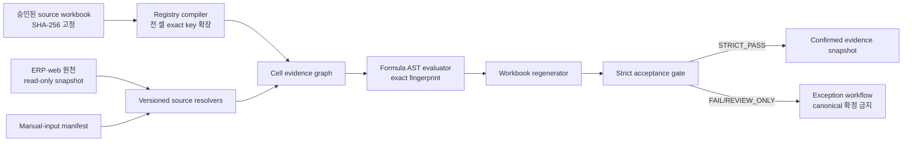

# 담당 C PRD — 매출이익보고서 evidence-RAG·전 셀 parity

- 작성일: 2026-08-13
- 상태: 초안 보존 — 실행 기준은 `docs/contracts/profit-report-evidence-rag.json`과 최신 `WebProfitReportConfirm` revision 계약으로 대체됨
- 입력: `.verify/inputs/profit-report-weeks-22-28/week-22.xlsx` ~ `week-28.xlsx`
- 상위 계약: `docs/contracts/weekly-profit-report.json`
- 기계 판독 초안: `docs/contracts/profit-report-evidence-rag.draft.json`

## 1. 결론

22~28차 재생성의 정답은 LLM이 추론하는 셀 매핑이 아니라, 원본 해시로 잠긴
**versioned mapping registry + deterministic source resolver + formula AST fingerprint +
confirmed evidence snapshot**이다. RAG는 승인된 근거를 정확 키로 검색하는 계층일 뿐,
유사도 검색·자연어 추론·암묵 fallback은 계산과 합격 판정에 참여하지 않는다.

최종 `STRICT_PASS`는 7개 차수 각각에서 다음 조건을 동시에 만족할 때만 부여한다.

| 지표 | 합격 조건 |
|---|---:|
| 저장된 OOXML 셀 매핑 | 100% |
| 수식 셀 exact AST fingerprint | 100% |
| 원화 정수 금액 | 원본 대비 절대오차 `<= 1원` |
| 비율 | 원본 대비 절대오차 `<= 0.01%p` (`0.0001`) |
| 미매핑 셀 | 0건 |
| 암묵 fallback | 0건 |

승인된 예외도 위 여섯 기준을 낮출 수 없다. 예외가 필요한 실행은 검토용
`REVIEW_ONLY`까지만 허용하고 `WebProfitReportConfirm` 확정 revision이나 canonical Excel
배포에는 사용할 수 없다.

## 2. 읽기 전용 원본 조사 결과

원본은 OOXML/캐시값을 읽기 전용으로 검사했다. 검사 전후 각 파일의 해시·크기·수정
시각은 동일했다. 아래 `formula text hash`는 현재 원본의 `sheet!cell + formula text`를
정렬해 계산한 사전 증거이며, 구현 시에는 raw OOXML formula metadata를 포함한 AST
fingerprint로 교체한다.

| 차수 | SHA-256 | 시트 | OOXML 셀 엔트리 | 수식 | shared/array | calcChain | formula text hash 앞 12자 |
|---:|---|---:|---:|---:|---:|---:|---|
| 22 | `72a8660e93d6593740246ddff5be74da0b10d0b4a07559f3fa06c4ce434252a0` | 11 | 41,798 | 1,885 | 570 / 875 | 1,885 | `bddd69fc9c58` |
| 23 | `b4ebf36ae4253a8d501bcacc147793a0b037fd933e0a29c3c68d131755dc6f9e` | 11 | 41,534 | 1,808 | 554 / 814 | 1,808 | `eb70deb584d6` |
| 24 | `6b92bbfa32d1b65aa065c8868e35476b0a471d1d0e1b6c6ec22b8e4036ef8bae` | 12 | 41,652 | 1,803 | 565 / 778 | 1,803 | `e610e3025450` |
| 25 | `4d20160a362b7eee3fc0241ce9df880713b1eda2e4c01785a4cb654ce7aebf06` | 11 | 41,943 | 1,831 | 557 / 810 | 1,831 | `419748920253` |
| 26 | `b42bcce6779f2b31cfa6fc8393c3dde6827382495b1d63e3d8d01c1a40fe6f5a` | 11 | 41,774 | 1,835 | 558 / 814 | 1,835 | `2d506b69b73e` |
| 27 | `2906ec876160f7fa2f0fbaeb1c9b89e49bda6a933cad9b7cabad9fbd7dd36689` | 11 | 42,011 | 1,830 | 486 / 886 | 1,830 | `b1029e71d27` |
| 28 | `d777e8745b3b1e2fbf89ac782633e9fd654f38fd7684ecbb620032221ecb156b` | 11 | 42,298 | 1,873 | 502 / 902 | 1,873 | `44fff79d41c8` |

공통으로 `콜롬비아 1차!N21:N24`, `콜롬비아 2차!N21:N24`에 `#DIV/0!`
8개가 있다. 위치·오류 토큰·수식 fingerprint까지 원본과 같아야 하는 승인된 원본
anomaly 후보이며, 이를 0이나 빈칸으로 바꾸는 것은 parity가 아니다.

확인된 버전 차이는 다음과 같다.

- 22~27 본표는 261개 수식과 같은 formula text manifest를 사용한다. 28차는 `국내`
  행이 들어오며 본표 수식이 270개로 바뀐다.
- 22~27 `B22`는 `공제`, 28 `B22`는 `국내`다. 행 번호나 현재 `CATEGORIES`만으로
  역매핑하면 안 된다.
- 24차만 `Sheet1!A2:F16` 보조 재고조정 시트가 있으며 F열 수식 14개를 포함한다.
  “표준 11개 시트” 가정은 100% 매핑을 깨뜨린다.
- 22→23, 23→24, 24→25, 25→26, 27→28은 본표 F 합계가 다음 차수 E 합계와
  정확히 이어진다. 26 F `8,919,590.217`과 27 E `12,578,453.10575`는
  `3,658,862.88875` 차이가 난다. 이는 자동 이월로 추정하지 않고 당시 확정 ProductStock와
  정확한 단가 evidence 또는 승인된 조정 증거가 있어야 한다. E 최종값 자체의 수기 입력은 금지한다.
- 관찰된 함수는 `AND`, `CHAR`, `CLEAN`, `IF`, `IFERROR`, `INDEX`, `ISNUMBER`,
  `MATCH`, `NOT`, `OR`, `SEARCH`, `SUBSTITUTE`, `SUBTOTAL`, `SUM`, `SUMIF`, `TRIM`이다.
  이 목록 밖 함수·토큰은 parser가 추측하지 않고 registry compile을 실패시킨다.

## 3. 초안 작성 당시 구현과의 간극

이 절은 통합 전 조사 기록이다. 현재 구현 상태는 executable contract와
`docs/work-reports/2026-08-13_profit-report-weeks-22-28-acceptance.md`를 따른다.

1. `scripts/profit-report-acceptance-harness.mjs`는 기존 단일 28차 경로와 5% 상대오차를
   기준으로 한다. 이번 계약은 7개 원본 전부와 원 단위 strict gate가 필요하다.
2. `data/profit-report-template.xlsx`는 본표 한 시트뿐이고 설명행 때문에 본문이 8행에서
   시작한다. 원본 22~28은 본문이 7행에서 시작하며 11개 또는 12개 시트를 가진다.
3. `lib/profitReportExcel.js`는 `setCell`에서 수식을 제거하고 계산값만 쓴다. 따라서
   현 경로는 수식 fingerprint 100% 및 전 시트 셀 매핑 100%를 만족할 수 없다.
4. `data/profit-report-confirmed-snapshots.json`은 28차 본표 행 값 위주이며 22~26은
   `UNVERIFIED`, 27은 합계만 부분 검증이다. 새 7개 원본으로 full-workbook evidence
   snapshot을 별도로 만들고, 기존 row payload는 호환 projection으로 유지해야 한다.
5. 과거 최근원가/단가표 fallback은 선택 근거를 숨겼다. 통합본은 확정 ProductStock와 정확한
   `OrderYear+OrderWeek+ProdKey`의 VERIFIED 단가 증거만 사용한다.
6. 통합본은 매출 집계에 `ShipmentMaster.isFix=1`과 `ShipmentDetail.isFix=1`을 모두 적용한다.
   운영 DB의 부분확정·교차연도 실측은 read-only query 2건으로 미검증 상태다.

## 4. 범위와 비범위

포함 범위는 22~28 source workbook의 모든 저장 셀, 수식, 오류, 병합/시트 구조,
수동 입력, deterministic ERP/web source resolver, 셀별 provenance, strict gate,
기존 snapshot/API와의 호환 계획이다.

비범위는 원본 Excel 수정, 운영 DB 보정, ERP 원장 쓰기, 브라우저 로그인, 최신
`nenova.exe` 실행, 개인 원본 접근, push/병합/배포다. 통합 산출물은 보고서 제품 코드와
웹 evidence schema 계약을 변경하지만 ERP 원장에는 쓰지 않는다.

## 5. 부작용 matrix

| 동작 | Order/Shipment | Warehouse | StockMaster/ProductStock/History | Estimate | WebProfitReport·통관·포워딩 | Evidence tables | WebProfitReportConfirm |
|---|---|---|---|---|---|---|---|
| 원본 ingest/registry compile | 보존 | 보존 | 보존 | 보존 | 보존 | 로컬 산출물만 | 보존 |
| live evidence 평가 | 읽기만 | 읽기만 | 읽기만 | 읽기만 | 읽기만 | run/cell 기록 | 보존 |
| evidence Excel export | 보존 | 보존 | 보존 | 보존 | 보존 | run 읽기 | 보존 |
| strict run 확정 | 읽기만 | 읽기만 | 읽기만 | 읽기만 | 읽기만 | snapshot link 생성 | 기존 테이블에 immutable payload 1회 생성 |
| 예외 요청·승인 | 보존 | 보존 | 보존 | 보존 | 보존 | exception audit만 | 보존 |

새 migration은 웹 전용 evidence 테이블만 만든다. 런타임 DDL과 ERP 테이블
`INSERT/UPDATE/DELETE/MERGE/EXEC`는 금지한다.

## 6. 아키텍처



### 6.1 셀 universe와 mapping registry

매핑 분모는 각 worksheet part에 실제 저장된 모든 OOXML `<c r="...">` 셀이다.
값이 없는 style-only 셀도 포함한다. 병합, 행·열 속성, defined name, print area,
sheet visibility/order는 별도 structure manifest에서 검사한다. whole-column 수식 참조를
Excel 최대 행까지 가상 셀로 확장하지는 않는다.

모든 저장 셀은 정확히 한 역할을 가져야 한다.

- `STATIC`: 제목, 헤더, 고정 설명
- `SOURCE`: ERP/web 추출값
- `MANUAL`: manifest에 등록된 수기 입력
- `FORMULA`: AST와 계산값을 가진 수식 셀
- `KNOWN_ERROR`: 위치·수식·오류 토큰이 승인된 원본 anomaly
- `EXPLICIT_BLANK`: style/구조 보존용 저장 빈 셀

registry 기본키는
`templateFamily + registryVersion + sourceSha256 + sheetId + cellAddress`다. 범위 규칙은
작성 편의 문법일 뿐, compile 시 개별 셀로 완전히 확장한다. 중복, 겹침, 미확장
wildcard, source SHA 미일치는 compile 실패다. registry release는 semver와 전체
canonical JSON SHA-256을 갖고, 수정은 새 버전으로만 한다.

### 6.2 evidence-RAG 검색 규칙

실행 경로의 retrieval은 exact lookup만 허용한다. 허용 검색키는 mapping ID,
semantic field ID, source artifact SHA, resolver ID/version, 업무키다. 임베딩·벡터
유사도·fuzzy label matching·LLM 생성 매핑은 계산 및 gate에서 금지한다.

자연어/벡터 검색은 사람이 신규 매핑 후보를 찾는 오프라인 보조 도구로만 사용할 수
있다. 후보는 registry PR, 원본 좌표, resolver test, reviewer/approver를 갖춘 새 release가
되기 전까지 실행 가능한 근거가 아니다.

### 6.3 formula AST fingerprint

raw formula text만 해시하지 않는다. `JSZip`으로 worksheet XML의 `<f>`를 읽어
`shared/array`, `si`, `ref`, anchor 정보를 보존하고, 다음 canonical AST envelope를
SHA-256한다.

```text
formulaKind + array/shared metadata + operator tree + function names +
string/numeric constants + sheetId + A1 reference + absolute/relative flags
```

- 함수명과 공백은 canonicalize하되 문자열 리터럴·상수·참조·피연산자 순서는 보존한다.
- exact fingerprint는 실제 셀 참조를 보존하며 strict gate에 사용한다.
- shape fingerprint는 현재 셀 기준 상대 offset으로 정규화해 fill family 중복 제거에만
  사용한다. shape 일치는 exact 불일치를 합격시키지 않는다.
- parser는 관찰된 함수와 산술/비교/문자열 결합, unary `+/-`, quoted Korean sheet,
  cell/range/whole-column 참조만 명시적으로 지원한다. 미지원 토큰은 fail-closed다.
- evaluator는 Excel의 blank/number/text/error coercion과 위 함수 subset을 golden test로
  고정한다. source의 알려진 `#DIV/0!`는 오류 값 자체를 재생성한다.

### 6.4 source resolver

resolver는 `resolverId@version`으로 고정하고 입력 업무키, SQL/정책 digest, 반환 타입,
단위, 허용 후보, null/zero 의미를 선언한다. 최소 catalog는 다음과 같다.

| resolver | 원천 | 핵심 조건 |
|---|---|---|
| `shipment.sales@1` | ViewShipment 또는 Shipment* | 선택 연도+세부차수+업체+품목, 확정 기준 명시 |
| `estimate.adjustment@1` | Estimate+ShipmentMaster | 선택 연도/차수, L/O 분리 |
| `warehouse.purchase@1` | Warehouse* | 선택 연도+차수, 운송료/중량 행 정책 |
| `stock.fixed-snapshot@1` | StockMaster+ProductStock | 동일 연도, `isFix=1`, ProductStock 존재, suffix/tie-break |
| `customs.structured@1` | WebCustomsWeekly/History | 명시적 split/zero/적용시점 |
| `forwarding.structured@1` | WebForwardingWeekly/FreightCost | 통화·BILL snapshot 고정 |
| `currency.taxable@1` | WebProfitReport/FreightCost/CurrencyMaster | 후보를 각각 기록하고 versioned 선택 정책 적용 |
| `manual.profit-report@1` | WebProfitReport | manifest에 등록된 셀만 허용 |
| `confirmed.cell@1` | evidence snapshot | historical replay의 immutable cell value |

live 평가의 여러 SELECT는 하나의 읽기 전용 MSSQL snapshot isolation source cut에서
실행한다. snapshot isolation을 보장할 수 없으면 실패하며 일반 read committed로
조용히 낮추지 않는다. 각 source row는 업무키와 canonical row hash를 provenance에
남긴다.

fallback은 resolver 내부 `catch`가 아니라 registry의 이름 있는 선택 정책으로만
가능하다. 결과에는 선택 후보, 거절 후보와 사유, `fallbackPolicyId`가 반드시 남아야
한다. 정책 ID가 없는 2순위 선택은 `IMPLICIT_FALLBACK`으로 즉시 실패한다. 22~28
historical canonical 재생성은 `confirmed.cell@1`을 사용하며 현재 ERP 값으로 과거
확정값을 덮지 않는다.

### 6.5 manual-input manifest

manifest는 수기 셀마다 다음을 선언한다.

```text
manualId, registryVersion, workbook cell, semantic field, source table/key,
value type/scale/unit/currency, present/null/blank/zero semantics,
effective week range, actor/timestamp requirement, approval policy
```

`WebProfitReport`의 H/R/S/note, 구조화 통관·콜롬비아·포워딩, `WebStockPriceEvidence`는
각기 별도 evidence ID를 사용한다. E/F 최종값 직접입력은 금지한다. `0`은 명시적 0, `null`은 미입력, 빈 문자열은
override 해제로 구분한다. source workbook의 하드코드 셀을 자동으로 “수기”로
추정하지 않는다. `SOURCE`, `STATIC`, `MANUAL` 중 하나로 reviewer가 명시해야 하며,
미분류 hardcode는 gate를 실패시킨다.

특히 26 F→27 E 차이는 자동 이월 규칙으로 흡수하지 않는다. 27 E를 만든 확정
ProductStock 스냅샷과 정확한 단가 evidence가 manifest/provenance로 확인될 때만 매핑한다.

### 6.6 confirmed snapshot과 provenance

기존 `WebProfitReportConfirm`/`WebProfitReportConfirmDetail`의 불변 revision과
확정 조회 projection 호환을 유지한다. 다음 evidence metadata는 실행 registry/provenance에 보존한다.

```text
registryVersion/digest, evidenceRunKey, sourceArtifactSha256,
cellManifestDigest, formulaDigest, manualManifestDigest, provenanceDigest,
gateResult, generatedWorkbookSha256, sourceCutAt
```

확정본의 full cell payload는 evidence run/cell 원장에 보존하고 기존 snapshot은 해당
run과 digest를 참조한다. 확정 조회는 현재 ERP를 재계산해 섞지 않는다. payload v1은
기존 reader가 그대로 읽고, v2 materializer가 호환 projection을 제공한다.

셀 provenance 최소 필드는 다음과 같다.

- 원본 artifact SHA, sheet/cell, mapping ID/version
- resolver ID/version 및 입력 업무키
- 선택 source row key/hash와 source cut
- manual ID와 입력자/시각 또는 confirmed snapshot ref
- formula exact/shape fingerprint와 선행 mapping IDs
- 적용 transformation/rounding/fallback policy IDs
- expected/actual typed value, delta, 판정
- confidence code와 evidence digest

### 6.7 confidence

confidence는 LLM 확률이 아니라 규칙 기반 상태다.

| 코드 | score | 의미 | strict 허용 |
|---|---:|---|---|
| `CONFIRMED_CELL` | 1.00 | SHA 고정 원본 또는 immutable snapshot과 exact match | 예 |
| `DETERMINISTIC_SOURCE` | 1.00 | exact resolver, row hash, 동일 source cut | 예 |
| `MANUAL_CONFIRMED` | 1.00 | manifest·actor·timestamp·키가 완전함 | 예 |
| `REVIEW_REQUIRED` | 0.50 | 승인 대기 또는 출처 불완전 | 아니오 |
| `MISSING` | 0.00 | 근거 없음 | 아니오 |

셀 confidence는 선행 evidence node의 최솟값이다. score는 설명용이며 금액/수식
tolerance를 완화하지 않는다.

### 6.8 exception approval

예외는 `exception code + run + exact cell/range + evidence digest + reason + expiry`로
요청한다. 요청자와 승인자는 달라야 하고, 승인 후 내용을 바꾸면 digest가 달라져
무효다. 다음은 예외 불가다.

- 미매핑 또는 중복 매핑
- formula exact fingerprint 불일치
- 암묵 fallback
- 금액/비율 tolerance 초과
- 선택 연도 누락 또는 교차연도 혼입
- source artifact/registry/provenance digest 불일치

원본에 이미 존재하고 fingerprint까지 일치하는 8개 `#DIV/0!`처럼 결과 parity를
깨지 않는 anomaly만 allowlist할 수 있다. 예외가 parity를 우회하면 결과는
`REVIEW_ONLY`이며 확정 불가다.

## 7. strict acceptance gate

### 7.1 셀별 비교

- `KRW_INTEGER`: Excel과 동일한 half-away-from-zero 정수화 후 절대오차 `<= 1`.
- `RATIO`: decimal 값 절대오차 `<= 0.0001`.
- 기타 decimal: manifest scale 기준 exact 또는 명시 tolerance.
- text: Unicode NFC 후 exact. 대소문자·공백을 바꾸는 mapping은 별도 transformation ID 필요.
- date: Excel serial/date-system과 timezone policy를 고정해 exact 비교.
- blank, explicit zero, error token: 서로 다른 값으로 exact 비교.

### 7.2 gate 순서

1. artifact SHA/OOXML package/외부 연결 검사
2. registry release·digest·중복/겹침 검사
3. 셀 universe 100% compile
4. formula parse 100% 및 exact fingerprint 100%
5. manual manifest completeness와 null/blank/zero 검사
6. resolver source cut·업무키·fallback provenance 검사
7. 모든 셀 typed value 비교
8. 시트 순서/visibility, used range, merge, row/column, defined name, print area 구조 검사
9. provenance/confidence/exception 정책 검사
10. 22~28 개별 `STRICT_PASS` 후에만 aggregate `STRICT_PASS`

하나라도 실패하면 생성 파일은 디버그 artifact로만 보관하고 사용자 다운로드·확정
경로에 노출하지 않는다.

## 8. 구현 파일 계획

새 파일은 다음 역할로 분리한다.

| 파일 | 역할 |
|---|---|
| `data/profit-report-evidence/registry/v1/index.json` | release/version/digest와 week별 registry index |
| `data/profit-report-evidence/registry/v1/week-22.json` ~ `week-28.json` | source SHA별 전 셀 매핑 |
| `data/profit-report-evidence/manual-input-manifest.v1.json` | 허용 수기 셀·DB 키·blank/zero 정책 |
| `data/profit-report-evidence/formula-functions.v1.json` | parser/evaluator allowlist |
| `lib/profitReportEvidence/ooxml.js` | raw OOXML cell/formula/structure 추출 |
| `lib/profitReportEvidence/registry.js` | registry load, compile, overlap/coverage 검증 |
| `lib/profitReportEvidence/formulaAst.js` | parser, exact/shape fingerprint |
| `lib/profitReportEvidence/formulaEvaluator.js` | 제한된 Excel 수식 결정론 evaluator |
| `lib/profitReportEvidence/resolvers.js` | resolver catalog와 explicit selection policy |
| `lib/profitReportEvidence/provenance.js` | 셀 evidence graph·digest |
| `lib/profitReportEvidence/gate.js` | strict gate·metrics·exception 정책 |
| `lib/profitReportEvidence/workbook.js` | 전체 시트 evidence workbook 재생성 |
| `lib/profitReportEvidence/store.js` | evidence 전용 테이블 read/write |
| `pages/api/sales/profit-report-evidence.js` | run/status/cell provenance API |
| `scripts/compile-profit-report-evidence-registry.mjs` | 7개 원본에서 후보 manifest 생성; 승인 없이는 release 불가 |
| `scripts/verify-profit-report-evidence.mjs` | 22~28 strict 평가 진입점 |
| `docs/migrations/2026-xx-xx_web_profit_report_evidence.sql` | evidence 전용 스키마 |

기존 파일의 후속 통합은 최소화한다.

- `lib/profitReportConfirm.js`: 기존 불변 revision reader/writer와 strict evidence link를 유지.
- `pages/api/sales/profit-report.js`: 기존 JSON shape 유지, opt-in evidence metadata/export와
  strict run 기반 `confirmSnapshot`만 추가.
- `lib/profitReportExcel.js`: legacy 경로 유지. evidence export는 새 builder에서 만들고
  7개 차수 통과 후 feature flag로만 기본 전환.
- `docs/contracts/weekly-profit-report.json`: 새 파일·테스트·gate를 umbrella scope에 추가.
- `package.json`: `test:profit-report-evidence`, `verify:profit-report-evidence:strict` 추가.

새 외부 formula parser 의존성은 도입하지 않는다. 저장소에 이미 있는 `jszip`, `xlsx`,
`xlsx-js-style`을 사용하고, 관찰된 문법 subset을 자체 parser/evaluator로 명시한다.

## 9. DB table 계획

모든 테이블은 `Web*` 전용이며 migration에서만 생성한다.

| 테이블 | 주요 키/컬럼 | 목적 |
|---|---|---|
| `WebProfitReportMappingRelease` | `RegistryVersion` PK, digest, git ref, status, reviewer, approver, activatedAt | 실행 가능한 registry release 고정 |
| `WebProfitReportEvidenceArtifact` | `ArtifactKey`, source SHA unique, byte length, media type, controlled storage ref | 원본 메타데이터; 원본 bytes 자체는 정책에 따라 별도 보관 |
| `WebProfitReportEvidenceRun` | `RunKey`, year/week, mode, release/artifact FK, sourceCutAt, 각 digest, metrics, gate status | 한 평가 실행의 불변 헤더 |
| `WebProfitReportEvidenceCell` | PK `(RunKey, SheetId, CellAddress)`, mapping/resolver/manual IDs, expected/actual JSON, formula hash, provenance JSON, confidence, status | 전 셀 evidence |
| `WebProfitReportEvidenceException` | exception key, run/scope/code, request/approval actor/time, digest, expiry, status | 이중 통제 예외 감사 |
| `WebProfitReportEvidenceSnapshotLink` | unique `SnapshotKey`, unique `RunKey`, payload/provenance digest | 기존 confirmed snapshot과 strict run 연결 |

`WebProfitReportEvidenceRun`은 여러 재평가를 허용하지만 immutable하다. 재실행은 새
RunKey를 만든다. `STRICT_PASS` run 하나만 snapshot에 연결할 수 있다.

## 10. API 계획

| API | 동작 | 쓰기 범위 |
|---|---|---|
| `GET /api/sales/profit-report-evidence?year=&week=` | 최신 run·metrics·digest 조회 | 없음 |
| `GET ...&runKey=&sheet=&cell=` | 셀 provenance 조회 | 없음 |
| `POST ... {action:"evaluate"}` | read-only source cut으로 새 run 평가 | evidence tables만 |
| `POST ... {action:"confirm",runKey}` | `STRICT_PASS` 검증 후 새 confirm revision 생성 | evidence link + WebProfitReportConfirm revision 1회 |
| `GET /api/sales/profit-report?excel=1&evidenceRunKey=` | strict run의 전체 workbook export | 없음 |
| `POST ... {action:"requestException"}` | 예외 요청 | exception table만 |
| `POST ... {action:"approveException"}` | 다른 승인자가 scope/digest 승인 | exception table만 |

기존 `GET/POST /api/sales/profit-report` 요청·응답은 깨지지 않는다. evidence 필드는
opt-in 추가 필드이며, 기존 `rows[].confirmedSnapshot.values` projection을 유지한다.

## 11. 테스트 계획

### 11.1 단위 테스트

- `profitReportEvidenceFormulaAst.test.js`: 함수/연산자/quoted sheet/whole-column,
  unary, shared/array metadata, exact-vs-shape, 상수·참조 변경 검출.
- `profitReportEvidenceRegistry.test.js`: 100% 확장, overlap/duplicate/wildcard/source SHA
  mismatch fail-closed.
- `profitReportEvidenceManual.test.js`: null/blank/zero, effective week, actor/timestamp,
  26→27 조정 근거.
- `profitReportEvidenceResolver.test.js`: 2025/2026 동일 차수 decoy, exact year/week,
  명시 fallback와 catch 금지, snapshot isolation 실패.
- `profitReportEvidenceProvenance.test.js`: 선행 셀 DAG, row hash, digest tamper,
  confidence 최소값.
- `profitReportEvidenceException.test.js`: 요청자≠승인자, expiry, critical gate 예외 불가.

### 11.2 golden/integration 테스트

- `profitReportEvidenceWeeks22To28.test.js`: 위 7개 SHA, 시트/셀/수식/calcChain 수,
  8개 known errors, 24차 `Sheet1`, 22~27/28 category version.
- `profitReportEvidenceWorkbookParity.test.js`: 각 차수 전체 셀·formula AST·구조 및
  원화/비율 tolerance.
- `profitReportEvidenceSnapshotCompatibility.test.js`: payload v1/v2, current API row
  shape, immutable guard, strict run link.
- `profitReportEvidenceCrossYear.test.js`: `OrderYear + OrderWeek + CustKey + ProdKey`
  및 report key `OrderYear + MajorWeek` 분리.
- `profitReportEvidenceGate.test.js`: 셀 하나 미매핑, 수식 상수 1개 변경, 2원 차이,
  `0.0101%p` 차이, 암묵 fallback 1건이 각각 전체를 실패시키는지 확인.

기존 5%/28차 단일 기준은 제거하고 22~28차 전체, 금액 ±1원, 비율 ±0.01%p의
strict script를 canonical 승인 기준으로 사용한다.

## 12. rollout과 완료 조건

1. **Inventory**: 7개 원본에서 raw cell/structure/formula 후보를 생성하고 사람이 역할과
   resolver를 전수 승인한다.
2. **Registry release v1**: compiler가 100%/0 overlap을 증명하고 digest를 고정한다.
3. **Baseline replay**: `confirmed.cell@1`로 7개 전체 workbook을 재생성해 strict gate를
   통과한다.
4. **Live reconcile**: read-only source cut으로 resolver 결과를 baseline과 비교한다.
   계약 충돌·26→27 차이는 근거가 해결될 때까지 FAIL/REVIEW_ONLY다.
5. **Shadow API**: 기존 다운로드를 유지한 채 evidence export를 opt-in으로 제공한다.
6. **Cutover**: 22~28 전 차수 strict 통과, v1/v2 호환, ERP 계약 가드와 build 통과 후에만
   feature flag 기본값을 바꾼다.

구현 완료 판정에는 다음이 모두 필요하다.

- 22~28 각 차수 mapping/fingerprint 100%, 금액/비율 tolerance, 미매핑/암묵 fallback 0.
- 모든 cell provenance가 registry/resolver/manual/snapshot 중 하나로 끝난다.
- `ShipmentMaster.isFix` 대 `ShipmentDetail.isFix` 근거 충돌이 해소되어 resolver
  predicate가 versioned contract로 고정된다.
- 26→27 E 조정의 실제 근거가 확인되거나 canonical strict 재생성 대상에서 명시적으로
  실패한다. 추정값으로 PASS하지 않는다.
- ERP 원장 부작용 0, runtime DDL 0, cross-year fixture 통과.
- `npm run test:erp-contract`, `npm run test:nenova-dnspy-evidence`,
  `npm run test:erp-manifest -- --changed-from origin/master`,
  `npm run guard:erp-writes -- --changed-from origin/master`, `npm run build` 통과.

운영 DB, 최신 EXE, 실제 브라우저, 배포 증거가 없으면 구현 코드가 존재해도 운영 완료는
`미검증`으로 남긴다.
